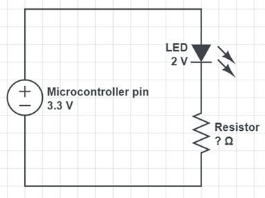
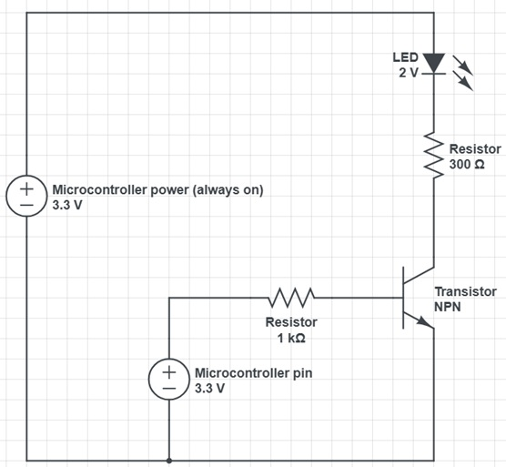

# Session 2

Reference: [Firebeetle 2 Board ESP32-C6 Microcontroller Wiki - DFRobot](https://wiki.dfrobot.com/SKU_DFR1075_FireBeetle_2_Board_ESP32_C6)

---

## 1. Download / Install Arduino IDE
- Download the Arduino IDE: [https://www.arduino.cc/en/software/](https://www.arduino.cc/en/software/)  

---

## 2. Set up for our specific board
- Follow the instructions to add Firebeetle 2 Board ESP32-C6:  
  [Arduino IDE Configuration](https://wiki.dfrobot.com/SKU_DFR1075_FireBeetle_2_Board_ESP32_C6#Arduino%20IDE%20Configuration)
- Go to step 8.

---

## 3. Create Your First Sketch
1. Open Arduino IDE  
2. Go to **Tools → Board → esp32 → DFRobot Firebeetle 2 ESP32-C6**  
3. Use code from ```code/step3.ino``` Open example sketch: **File → Examples → 01.Basics → Blink**

---

## 4. Upload Sketch
1. Plug in your microcontroller to the computer **while holding the 9/BOOT button**  
2. Go to **Tools → Port → COMX (ESP32 Family Device)**  
3. Click the **Upload (→) button**  
4. The onboard LED should start blinking

## 5. Change Circuit to Flash an External LED



### Step a: Calculate the Resistor Value
- LEDs require a **current-limiting resistor** to prevent too much current flowing through them, which could **burn out the LED** or **damage the Pico pin**.  
- **LED considerations:**  
  - Voltage ~2 V, current ~10 mA  
  - Micontroller pins operate at 3.3 V  
  - Calculate appropriate resistor for the LED
  - Answer: > 130 ohms

### Step b: Update the Code

- Reference microcontroller pins: [Firebeetle 2 ESP32-C6 Pinout](https://wiki.dfrobot.com/SKU_DFR1075_FireBeetle_2_Board_ESP32_C6#Pin%20Diagram)  

- Define a pin to control the LED in your sketch:  
```cpp
const int LEDPin = 8; // corresponds to GP8
````
- See ```code/step6.ino``` if needed

---

### Step c: Wire the Circuit

* Connect the components using the Pico pins you looked up:

  * **LED long leg is positive**

* Upload the sketch, and the LED should blink.

---

## 6. Read Temperature with BMP280

1. To communicate to computer via serial we must set **Tools → USB CDC On Boot → Enabled**
2. Install library: **Tools → Manage Libraries → Adafruit BMP280**
2. Open ```code/step6.ino``` or example sketch: **File → Examples → Adafruit BMP280 Library → bmp280test**
3. Four pins are required
  - Power
  - Ground
  - SDA
  - SCL  
4. Upload sketch as before
5. Open **Serial Monitor** (top right) and set **baud rate to 9600**

---

## 7. Combine LED Circuit and Temperature Reading

* Modify sketch:

  * If temperature exceeds 24 °C → turn on LED
  * Else → turn LED off
* See ```code/step7.ino``` if needed

---

## 8. Improvement: Use a Transistor to Drive the LED

* Use an **NPN transistor** (e.g., BC337)
* This allows the microcontroller to safely switch higher currents



---

## 9. Unplug from computer

Once you have uploaded the code to the microncontroller from the computer, you can unplug the microcontroller and just plug it into any USB power supply. The code you uploaded will continue running in a loop.

---

## 10. Reading humidity

The sensor connected to your microcontroller also has an AHT20 temperature and humidity sensor on the board. This sensor also communicates via I2C so no additional wiring is needed. Can you also obtain the temperature and humidity reading from this sensor?